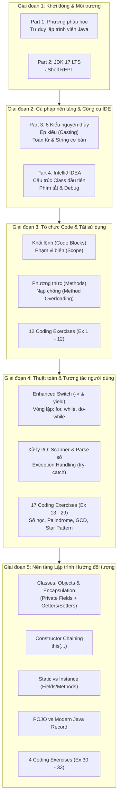

# CẨM NANG HỌC TẬP TOÀN DIỆN JAVA MASTERCLASS (JDK 17)
> **Khóa học:** Java Programming Masterclass (JDK 17 + IntelliJ IDEA)  
> **Repository:** `Udemy`  
> **Tài liệu nguồn:** Toàn bộ Slide thuyết trình (Parts 1–7) & Toàn bộ Mã nguồn dự án (60+ Java files, 33 bài Coding Exercises)  
> **Cập nhật ngày:** 09/10/2026  

---

## MỤC LỤC
1. [Bản đồ Lộ trình Học tập (Roadmap & Mindmap)](#1-bản-đồ-lộ-trình-học-tập-roadmap--mindmap)
2. [Part 1: Khởi động & Phương pháp học Java hiệu quả](#2-part-1-khởi-động--phương-pháp-học-java-hiệu-quả)
3. [Part 2: Cài đặt Môi trường Phát triển (JDK 17 & JShell)](#3-part-2-cài-đặt-môi-trường-phát-triển-jdk-17--jshell)
4. [Part 3: Những bước đầu tiên – Biến, 8 Kiểu Nguyên Thủy & Toán tử](#4-part-3-những-bước-đầu-tiên--biến-8-kiểu-nguyên-thủy--toán-tử)
5. [Part 4: Chuyển dịch từ JShell sang IntelliJ IDEA](#5-part-4-chuyển-dịch-từ-jshell-sang-intellij-idea)
6. [Part 5: Biểu thức, Khối lệnh, Phương thức & Nạp chồng (Method Overloading)](#6-part-5-biểu-thức-khối-lệnh-phương-thức--nạp-chồng-method-overloading)
   - [Chi tiết 12 bài Coding Exercises (Ex 1 – 12)](#chi-tiết-12-bài-coding-exercises-part-5-ex-1--12)
7. [Part 6: Điều khiển luồng, Vòng lặp & Ứng dụng Tương tác Console](#7-part-6-điều-khiển-luồng-vòng-lặp--ứng-dụng-tương-tác-console)
   - [Chi tiết 17 bài Coding Exercises (Ex 13 – 29)](#chi-tiết-17-bài-coding-exercises-part-6-ex-13--29)
8. [Part 7: Lập trình Hướng đối tượng Nền tảng – Classes & Record](#8-part-7-lập-trình-hướng-đối-tượng-nền-tảng--classes--record)
   - [Chi tiết 4 bài Coding Exercises (Ex 30 – 33)](#chi-tiết-4-bài-coding-exercises-part-7-ex-30--33)
9. [Bảng Tổng hợp So sánh & Bẫy kinh điển (Gotchas & Best Practices)](#9-bảng-tổng-hợp-so-sánh--bẫy-kinh-điển-gotchas--best-practices)

---

## 1. Bản đồ Lộ trình Học tập (Roadmap & Mindmap)



---

## 2. Part 1: Khởi động & Phương pháp học Java hiệu quả

### 2.1. Nội dung Slide nổi bật (Slides 1 – 8)
- **Tầm quan trọng của Java:** Java là một trong những ngôn ngữ lập trình phổ biến nhất thế giới trong khối doanh nghiệp (Enterprise), Android, tài chính ngân hàng và hệ thống phân tán lớn.
- **Phiên bản Java sử dụng:** Khóa học chuẩn hóa trên **Java 17 LTS (Long-Term Support)**. Đây là phiên bản tiêu chuẩn có độ ổn định cao, hỗ trợ nhiều cải tiến ngôn ngữ hiện đại (Text Blocks, Records, Switch Expressions, Sealed Classes).
- **Quy tắc vàng để thành công (The Biggest Tip):**
  - *Không chỉ xem video thụ động:* Phải trực tiếp gõ code (Active Coding).
  - *Chấp nhận sai và debug:* Đọc kỹ thông báo lỗi của trình biên dịch và JVM.
  - *Thử nghiệm:* Thay đổi tham số, cố tình tạo ra bug để hiểu cơ chế hoạt động.

---

## 3. Part 2: Cài đặt Môi trường Phát triển (JDK 17 & JShell)

### 3.1. Nội dung Slide & Tài liệu (Slides 10 – 13)
- **JDK vs JRE:**
  - **JRE (Java Runtime Environment):** Chỉ để chạy ứng dụng Java.
  - **JDK (Java Development Kit):** Bao gồm cả JRE, trình biên dịch `javac`, công cụ phân tích và các tiện ích dòng lệnh. Lập trình viên bắt buộc phải cài đặt JDK.
- **Biến môi trường (Environment Variables):**
  - Thiết lập `JAVA_HOME` trỏ tới thư mục cài đặt JDK 17.
  - Thêm `%JAVA_HOME%\bin` vào `PATH` để gọi `java`, `javac`, `jshell` từ bất kỳ terminal nào.
- **Làm quen với JShell (Java REPL - Read-Eval-Print Loop):**
  - Ra mắt từ Java 9, cho phép thử nghiệm nhanh các câu lệnh, biểu thức mà không cần tạo file `.java`, khai báo `class` hay phương thức `main`.

---

## 4. Part 3: Những bước đầu tiên – Biến, 8 Kiểu Nguyên Thủy & Toán tử

### 4.1. Khái niệm Cốt lõi (Slides 14 – 26 & Doc1.docx)
- **Statement (Câu lệnh):** Một đơn vị thực thi hoàn chỉnh trong Java, luôn kết thúc bằng dấu chấm phẩy `;`.
- **Expression (Biểu thức):** Cấu trúc mã sinh ra một giá trị duy nhất (ví dụ: `(5 + 3) * 2`).
- **Keyword (Từ khóa):** Các từ dành riêng có ý nghĩa cố định đối với trình biên dịch (như `public`, `class`, `static`, `void`, `int`, `double`...).

### 4.2. 8 Kiểu dữ liệu nguyên thủy (Primitive Types)
Java quản lý 8 kiểu dữ liệu nguyên thủy được phân bổ trực tiếp trên vùng nhớ Stack:

| Kiểu | Kích thước | Khoảng giá trị | Giá trị mặc định | Ghi chú kỹ thuật |
| :--- | :--- | :--- | :--- | :--- |
| `byte` | 8 bits (1 byte) | -128 đến 127 | `0` | Tiết kiệm bộ nhớ trong mảng lớn |
| `short` | 16 bits (2 bytes) | -32,768 đến 32,767 | `0` | Ít dùng trong thực tế |
| `int` | 32 bits (4 bytes) | ~ -2.14 tỷ đến 2.14 tỷ | `0` | **Kiểu số nguyên mặc định của Java** |
| `long` | 64 bits (8 bytes) | -9x10^18 đến 9x10^18 | `0L` | Cần hậu tố `L` (ví dụ: `50000L`) |
| `float` | 32 bits (4 bytes) | ~ 7 chữ số thập phân | `0.0f` | Độ chính xác đơn, hậu tố `f` |
| `double` | 64 bits (8 bytes) | ~ 15-16 chữ số thập phân | `0.0d` | **Kiểu số thực mặc định của Java** |
| `char` | 16 bits (2 bytes) | Ký tự Unicode (`\u0000` đến `\uffff`) | `'\u0000'` | Nháy đơn `'A'`, lưu mã số Unicode |
| `boolean`| 1 bit logic | `true` hoặc `false` | `false` | Phục vụ rẽ nhánh logic |

> **Phân biệt kiểu nguyên thủy vs String:**
> `String` là một **Class (Reference Type)** đại diện cho chuỗi ký tự bất biến (Immutable), lưu trữ trên Heap (String Constant Pool).

### 4.3. Cơ chế Ép kiểu (Type Casting)
- **Ép kiểu tự động (Widening / Nâng kiểu):** Chuyển từ kiểu có kích thước nhỏ sang kiểu lớn hơn (`byte` -> `short` -> `int` -> `long` -> `float` -> `double`). Không mất mát dữ liệu.
- **Ép kiểu tường minh (Narrowing / Hạ kiểu):** Chuyển từ kiểu lớn về kiểu nhỏ hơn. Có nguy cơ tràn số (overflow) hoặc mất dữ liệu phần thập phân.
  ```java
  double d = 9.99;
  int i = (int) d; // Kết quả là 9 (cắt cụt phần thập phân)
  
  byte myByte = 50;
  // Biểu thức số học với byte/short sẽ tự động thăng hạng lên int:
  byte result = (byte) (myByte / 2); // Bắt buộc phải ép kiểu về byte
  ```

### 4.4. Toán tử & Phép viết tắt
- Toán tử số học: `+`, `-`, `*`, `/`, `%` (chia lấy dư).
- Toán tử gán kết hợp: `+=`, `-=`, `*=`, `/=`, `%=`.
- Toán tử tăng/giảm: `++var` (tiền tố - tăng trước), `var++` (hậu tố - tăng sau).

---

## 5. Part 4: Chuyển dịch từ JShell sang IntelliJ IDEA

### 5.1. Nội dung Slide (Slides 27 – 43)
- **Tại sao cần IDE:** Khi dự án phát triển từ vài dòng lệnh thành hàng trăm lớp và thư viện liên kết, IDE cung cấp môi trường quản lý file, kiểm tra cú pháp tức thời, tự động hoàn thành mã (IntelliSense), và trình gỡ lỗi (Debugger).
- **Cấu trúc dự án Java chuẩn trong IntelliJ IDEA:**
  - Thư mục gốc chứa file cấu hình `.idea` và file module `.iml`.
  - Thư mục `src/`: Nơi lưu trữ mã nguồn `.java`.
  - Thư mục `out/`: Nơi chứa bytecode biên dịch `.class`.

### 5.2. Mã nguồn mẫu đã thực hành
- [`HelloWorld/src/Hello.java`](file:///D:/Project/Udemy/Part4%20-%20Transitioning%20from%20JShell%20to%20IntelliJ%20IDEA/HelloWorld/src/Hello.java):
  - Kiểm tra toán tử logic `&&` (AND ngắn mạch), `||` (OR ngắn mạch).
  - Phân biệt toán tử gán `=` và toán tử so sánh bằng `==`.
  - Sử dụng toán tử 3 ngôi (Ternary Operator): `variable = (condition) ? valueIfTrue : valueIfFalse;`.
- [`HelloWorld/src/FirstClass.java`](file:///D:/Project/Udemy/Part4%20-%20Transitioning%20from%20JShell%20to%20IntelliJ%20IDEA/HelloWorld/src/FirstClass.java):
  - Phím tắt kinh điển của IntelliJ: `psvm` (sinh hàm `public static void main`) và `sout` (sinh `System.out.println`).

---

## 6. Part 5: Biểu thức, Khối lệnh, Phương thức & Nạp chồng (Method Overloading)

### 6.1. Phương thức (Methods) & Phạm vi biến (Scope)
- **Khai báo phương thức:**
  ```java
  public static int calculateScore(boolean gameOver, int score, int levelCompleted, int bonus) {
      if (gameOver) {
          int finalScore = score + (levelCompleted * bonus);
          return finalScore;
      }
      return -1;
  }
  ```
- **Scope:** Biến `finalScore` chỉ tồn tại bên trong khối lệnh `{}` của `if`. Truy cập ngoài phạm vi sẽ báo lỗi biên dịch.

### 6.2. Nạp chồng phương thức (Method Overloading)
- **Định nghĩa:** Là kỹ thuật cho phép nhiều phương thức trong cùng một lớp có **cùng tên** nhưng **chữ ký phương thức (signature) khác nhau**.
- **Quy tắc phân biệt:**
  1. Số lượng tham số khác nhau.
  2. Hoặc kiểu dữ liệu của tham số khác nhau.
- **Bẫy sống còn:** **Chỉ thay đổi kiểu trả về (return type) KHÔNG tạo nên method overloading!** Trình biên dịch sẽ báo lỗi trùng lặp phương thức (`method is already defined`).

*Trích mã nguồn dự án [`OverloadingChanllege/src/SecondsAndMinutesChallenge.java`](file:///D:/Project/Udemy/Part5%20-%20Mastering%20Java%20Expressions,%20Statement,%20Code,%20And%20Method%20Overloading/Code/OverloadingChanllege/src/SecondsAndMinutesChallenge.java):*
```java
// Phương thức 1: Nhận vào tổng số giây
public static String getDurationString(int seconds) {
    if (seconds < 0) {
        return "Invalid data for seconds(" + seconds + "), must be a positive integer value";
    }
    // Tái sử dụng phương thức 2 qua nạp chồng:
    return getDurationString(seconds / 60, seconds % 60);
}

// Phương thức 2: Nhận phút và giây
public static String getDurationString(int minutes, int seconds) {
    if (minutes < 0 || seconds < 0 || seconds > 59) {
        return "Invalid data";
    }
    int hours = minutes / 60;
    int remainingMinutes = minutes % 60;
    return hours + "h " + remainingMinutes + "m " + seconds + "s";
}
```

---

### Chi tiết 12 bài Coding Exercises (Part 5: Ex 1 – 12)

| Bài | Tên bài tập & Phương thức | Logic xử lý & Kỹ thuật chính | File mã nguồn |
| :--- | :--- | :--- | :--- |
| **Ex 1** | **Check Number**<br/>`checkNumber(int number)` | Dùng `if-else if-else` kiểm tra `> 0` ("positive"), `< 0` ("negative"), ngược lại "zero". | [`ExCoding1.java`](file:///D:/Project/Udemy/Part5%20-%20Mastering%20Java%20Expressions,%20Statement,%20Code,%20And%20Method%20Overloading/Code/P5-Challenge/src/ExCoding1.java) |
| **Ex 2** | **Speed Converter**<br/>`toMilesPerHour(double kmh)`<br/>`printConversion(double kmh)` | Đổi km/h sang dặm/h (`kmh / 1.609`). Dùng `Math.round()` làm tròn số nguyên. Xử lý giá trị âm trả về `-1`. | [`ExCoding2.java`](file:///D:/Project/Udemy/Part5%20-%20Mastering%20Java%20Expressions,%20Statement,%20Code,%20And%20Method%20Overloading/Code/P5-Challenge/src/ExCoding2.java) |
| **Ex 3** | **MegaBytes Converter**<br/>`printMegaBytesAndKiloBytes(int kb)` | Chuyển đổi dung lượng bộ nhớ: `1 MB = 1024 KB`. Tính MB bằng `kb / 1024`, KB dư bằng `kb % 1024`. | [`ExCoding3.java`](file:///D:/Project/Udemy/Part5%20-%20Mastering%20Java%20Expressions,%20Statement,%20Code,%20And%20Method%20Overloading/Code/P5-Challenge/src/ExCoding3.java) |
| **Ex 4** | **Barking Dog**<br/>`shouldWakeUp(boolean barking, int hourOfDay)` | Đánh giá điều kiện thức giấc: Chó sủa (`barking == true`) và thời gian nằm ngoài khoảng thức (`< 8` hoặc `> 22`), kiểm tra giờ hợp lệ `0 <= hour <= 23`. | [`ExCoding4.java`](file:///D:/Project/Udemy/Part5%20-%20Mastering%20Java%20Expressions,%20Statement,%20Code,%20And%20Method%20Overloading/Code/P5-Challenge/src/ExCoding4.java) |
| **Ex 5** | **Leap Year Calculator**<br/>`isLeapYear(int year)` | Thuật toán năm nhuận: `(year % 4 == 0 && year % 100 != 0) \|\| (year % 400 == 0)`. Kiểm tra khoảng hợp lệ `1 <= year <= 9999`. | [`ExCoding5.java`](file:///D:/Project/Udemy/Part5%20-%20Mastering%20Java%20Expressions,%20Statement,%20Code,%20And%20Method%20Overloading/Code/P5-Challenge/src/ExCoding5.java) |
| **Ex 6** | **DecimalComparator**<br/>`areEqualByThreeDecimalPlaces(double n1, double n2)` | So sánh bằng đến 3 chữ số thập phân: Ép kiểu nguyên `(int)(n1 * 1000) == (int)(n2 * 1000)` để loại bỏ sai số dấu phẩy động. | [`ExCoding6.java`](file:///D:/Project/Udemy/Part5%20-%20Mastering%20Java%20Expressions,%20Statement,%20Code,%20And%20Method%20Overloading/Code/P5-Challenge/src/ExCoding6.java) |
| **Ex 7** | **Equal Sum Checker**<br/>`hasEqualSum(int a, int b, int c)` | Kiểm tra phương trình `a + b == c`. Trả về kiểu `boolean`. | [`ExCoding7.java`](file:///D:/Project/Udemy/Part5%20-%20Mastering%20Java%20Expressions,%20Statement,%20Code,%20And%20Method%20Overloading/Code/P5-Challenge/src/ExCoding7.java) |
| **Ex 8** | **Teen Number Checker**<br/>`hasTeen(int a, int b, int c)`<br/>`isTeen(int age)` | Kiểm tra độ tuổi thanh thiếu niên `[13, 19]`. Tái sử dụng phương thức `isTeen()` để kiểm tra từng tham số trong `hasTeen()`. | [`ExCoding8.java`](file:///D:/Project/Udemy/Part5%20-%20Mastering%20Java%20Expressions,%20Statement,%20Code,%20And%20Method%20Overloading/Code/P5-Challenge/src/ExCoding8.java) |
| **Ex 9** | **Area Calculator**<br/>`area(double radius)`<br/>`area(double x, double y)` | Áp dụng Method Overloading: Tính diện tích hình tròn `radius * radius * Math.PI` và hình chữ nhật `x * y`. Validate tham số âm trả về `-1.0`. | [`ExCoding9.java`](file:///D:/Project/Udemy/Part5%20-%20Mastering%20Java%20Expressions,%20Statement,%20Code,%20And%20Method%20Overloading/Code/P5-Challenge/src/ExCoding9.java) |
| **Ex 10** | **Minutes To Years & Days**<br/>`printYearsAndDays(long minutes)` | Đổi phút sang năm và ngày: `hours = minutes / 60`, `days = hours / 24`, `years = days / 365`, `remainingDays = days % 365`. | [`ExCoding10.java`](file:///D:/Project/Udemy/Part5%20-%20Mastering%20Java%20Expressions,%20Statement,%20Code,%20And%20Method%20Overloading/Code/P5-Challenge/src/ExCoding10.java) |
| **Ex 11** | **Equality Printer**<br/>`printEqual(int a, int b, int c)` | Phân loại trạng thái 3 số: Kiểm tra âm ("Invalid Value"), 3 số bằng nhau ("All numbers are equal"), 3 số khác nhau đôi một, hoặc trạng thái hỗn hợp. | [`ExCoding11.java`](file:///D:/Project/Udemy/Part5%20-%20Mastering%20Java%20Expressions,%20Statement,%20Code,%20And%20Method%20Overloading/Code/P5-Challenge/src/ExCoding11.java) |
| **Ex 12** | **Playing Cat**<br/>`isCatPlaying(boolean summer, int temp)` | Xác định nhiệt độ chơi đùa của mèo: Giới hạn trên linh hoạt bằng toán tử 3 ngôi `maxTemp = summer ? 45 : 35`. Kiểm tra `temp >= 25 && temp <= maxTemp`. | [`ExCoding12.java`](file:///D:/Project/Udemy/Part5%20-%20Mastering%20Java%20Expressions,%20Statement,%20Code,%20And%20Method%20Overloading/Code/P5-Challenge/src/ExCoding12.java) |

---

## 7. Part 6: Điều khiển luồng, Vòng lặp & Ứng dụng Tương tác Console

### 7.1. Cải tiến Switch Expression (Java 14+)
- Switch truyền thống thường gặp lỗi **Fall-through** (quên `break;` khiến code tự động trôi xuống case dưới).
- Java 14+ giới thiệu **Enhanced Switch** với cú pháp mũi tên `->`:
  - Tự động ngắt (không cần `break;`).
  - Cho phép gom nhiều nhãn: `case "MON", "TUE", "WED" -> ...`.
  - Có thể đóng vai trò như một **Expression** để gán trực tiếp giá trị cho biến.
  - Khối lệnh phức tạp trong case dùng từ khóa `yield` để trả về giá trị.

*Trích mã nguồn dự án [`SwitchExpression/src/Main.java`](file:///D:/Project/Udemy/Part6%20-%20Mastering%20Conditional%20Logic,%20Loops,%20And%20Interactive%20Java%20Applications/Code/SwitchExpression/src/Main.java):*
```java
String dayOfWeek = switch (day) {
    case 0 -> { 
        System.out.println("Processing Sunday");
        yield "Sunday"; 
    }
    case 1 -> "Monday";
    case 2 -> "Tuesday";
    default -> "Invalid day";
};
```

### 7.2. Bộ ba vòng lặp: `for`, `while`, `do-while`
1. **`for` loop:** Lặp với số lần xác định trước.
2. **`while` loop:** Kiểm tra điều kiện ở đầu vòng lặp. Nếu điều kiện `false` ngay từ đầu, vòng lặp sẽ không chạy lần nào.
3. **`do-while` loop:** Luôn chạy thân vòng lặp **ít nhất 1 lần** trước khi kiểm tra điều kiện. Đây là cấu trúc lý tưởng cho bài toán bắt người dùng nhập liệu lại cho đến khi hợp lệ.

### 7.3. Kỹ thuật tách chữ số trong số nguyên
Áp dụng xuyên suốt các bài toán số học (Palindrome, tổng chữ số, đảo số):
- **Lấy chữ số cuối cùng:** `digit = number % 10;`
- **Loại bỏ chữ số cuối cùng:** `number = number / 10;`

### 7.4. Đọc dữ liệu Console & Xử lý Ngoại lệ
- **`System.console()`:** Rất an toàn và tiện lợi, tuy nhiên sẽ trả về `null` nếu chạy trong môi trường tích hợp như IntelliJ Terminal.
- **`Scanner(System.in)`:** Công cụ đọc bàn phím tiêu chuẩn.
- **Bẫy Scanner nuốt dòng:** Khi gọi `scanner.nextInt()` rồi gọi `scanner.nextLine()`, ký tự xuống dòng `\n` còn sót lại trong bộ đệm sẽ khiến lệnh `nextLine()` sau đó bị nhảy qua.
- **Giải pháp chuẩn:** Luôn đọc chuỗi bằng `scanner.nextLine()`, sau đó chuyển đổi bằng `Integer.parseInt()` hoặc `Double.parseDouble()` kết hợp khối `try-catch (NumberFormatException e)`.

---

### Chi tiết 17 bài Coding Exercises (Part 6: Ex 13 – 29)

| Bài | Tên bài tập & Phương thức | Logic xử lý & Kỹ thuật chính | File mã nguồn |
| :--- | :--- | :--- | :--- |
| **Ex 13** | **Number In Word**<br/>`printNumberInWord(int n)` | Áp dụng câu lệnh `switch` để in các số từ 0 - 9 thành "ZERO".."NINE", các số khác in "OTHER". | [`ExCoding13.java`](file:///D:/Project/Udemy/Part6%20-%20Mastering%20Conditional%20Logic,%20Loops,%20And%20Interactive%20Java%20Applications/Code/P6-Challenge/src/ExCoding13.java) |
| **Ex 14** | **Number Of Days In Month**<br/>`getDaysInMonth(int m, int y)` | Kết hợp switch kiểm tra số ngày của tháng (tháng 30 ngày, 31 ngày) và hàm `isLeapYear()` để xác định tháng 2 có 28 hay 29 ngày. | [`ExCoding14.java`](file:///D:/Project/Udemy/Part6%20-%20Mastering%20Conditional%20Logic,%20Loops,%20And%20Interactive%20Java%20Applications/Code/P6-Challenge/src/ExCoding14.java) |
| **Ex 15** | **Sum Odd Range**<br/>`sumOdd(int start, int end)` | Dùng vòng lặp `for` duyệt từ `start` đến `end`, kiểm tra phương thức `isOdd(i)` và cộng dồn vào biến `sum`. | [`ExCoding15.java`](file:///D:/Project/Udemy/Part6%20-%20Mastering%20Conditional%20Logic,%20Loops,%20And%20Interactive%20Java%20Applications/Code/P6-Challenge/src/ExCoding15.java) |
| **Ex 16** | **Number Palindrome**<br/>`isPalindrome(int number)` | Kiểm tra số đối xứng: Dùng vòng lặp `while` trích từng chữ số bằng `% 10` để xây dựng số đảo ngược `reverse = reverse * 10 + lastDigit`. | [`ExCoding16.java`](file:///D:/Project/Udemy/Part6%20-%20Mastering%20Conditional%20Logic,%20Loops,%20And%20Interactive%20Java%20Applications/Code/P6-Challenge/src/ExCoding16.java) |
| **Ex 17** | **First And Last Digit Sum**<br/>`sumFirstAndLastDigit(int n)` | Chữ số cuối là `n % 10`. Dùng vòng lặp `while (n >= 10) n /= 10;` để tìm ra chữ số đầu tiên, sau đó tính tổng. | [`ExCoding17.java`](file:///D:/Project/Udemy/Part6%20-%20Mastering%20Conditional%20Logic,%20Loops,%20And%20Interactive%20Java%20Applications/Code/P6-Challenge/src/ExCoding17.java) |
| **Ex 18** | **Even Digit Sum**<br/>`getEvenDigitSum(int number)` | Duyệt qua từng chữ số của `number`, nếu `digit % 2 == 0` thì cộng vào tổng chẵn. Xử lý số âm trả về `-1`. | [`ExCoding18.java`](file:///D:/Project/Udemy/Part6%20-%20Mastering%20Conditional%20Logic,%20Loops,%20And%20Interactive%20Java%20Applications/Code/P6-Challenge/src/ExCoding18.java) |
| **Ex 19** | **Shared Digit**<br/>`hasSharedDigit(int a, int b)` | Kiểm tra 2 số có chữ số nào trùng nhau trong phạm vi `10 <= n <= 99`. Tách các chữ số của cả hai số để so sánh chéo. | [`ExCoding19.java`](file:///D:/Project/Udemy/Part6%20-%20Mastering%20Conditional%20Logic,%20Loops,%20And%20Interactive%20Java%20Applications/Code/P6-Challenge/src/ExCoding19.java) |
| **Ex 20** | **Last Digit Checker**<br/>`hasSameLastDigit(int a, b, c)`<br/>`isValid(int n)` | Kiểm tra `a % 10`, `b % 10`, `c % 10`. Nếu có ít nhất 2 chữ số cuối giống nhau thì trả về `true`. Validate phạm vi [10, 1000]. | [`ExCoding20.java`](file:///D:/Project/Udemy/Part6%20-%20Mastering%20Conditional%20Logic,%20Loops,%20And%20Interactive%20Java%20Applications/Code/P6-Challenge/src/ExCoding20.java) |
| **Ex 21** | **All Factors**<br/>`printFactors(int number)` | Vòng lặp `for (int i = 1; i <= number; i++)` kiểm tra `number % i == 0` để in tất cả các ước số của một số nguyên dương. | [`ExCoding21.java`](file:///D:/Project/Udemy/Part6%20-%20Mastering%20Conditional%20Logic,%20Loops,%20And%20Interactive%20Java%20Applications/Code/P6-Challenge/src/ExCoding21.java) |
| **Ex 22** | **Greatest Common Divisor (GCD)**<br/>`getGreatestCommonDivisor(int a, int b)` | Thuật toán tìm Ước chung lớn nhất bằng vòng lặp ngược hoặc giải thuật Euclid: Lấy số dư liên tiếp cho tới khi đạt 0. | [`ExCoding22.java`](file:///D:/Project/Udemy/Part6%20-%20Mastering%20Conditional%20Logic,%20Loops,%20And%20Interactive%20Java%20Applications/Code/P6-Challenge/src/ExCoding22.java) |
| **Ex 23** | **Perfect Number**<br/>`isPerfectNumber(int number)` | Kiểm tra số hoàn hảo (tổng tất cả các ước số nhỏ hơn chính nó bằng chính nó). Ví dụ: 6 có các ước 1, 2, 3 -> tổng bằng 6. | [`ExCoding23.java`](file:///D:/Project/Udemy/Part6%20-%20Mastering%20Conditional%20Logic,%20Loops,%20And%20Interactive%20Java%20Applications/Code/P6-Challenge/src/ExCoding23.java) |
| **Ex 24** | **Number To Words**<br/>`numberToWords(int number)`<br/>`reverse()`, `getDigitCount()` | Chuyển đổi số thành chữ tiếng Anh ("Zero", "One"...). Kỹ thuật: Đảo ngược số rồi in, sau đó dùng `getDigitCount()` để in bù các số 0 ở đuôi bị mất do đảo. | [`ExCoding24.java`](file:///D:/Project/Udemy/Part6%20-%20Mastering%20Conditional%20Logic,%20Loops,%20And%20Interactive%20Java%20Applications/Code/P6-Challenge/src/ExCoding24.java) |
| **Ex 25** | **Flour Pack Problem**<br/>`canPack(int bigCount, int smallCount, int goal)` | Bài toán đóng gói bột: Túi to 5kg, túi nhỏ 1kg. Ràng buộc không được chia dở túi to. Tính toán số túi to tối đa có thể dùng và bù túi nhỏ. | [`ExCoding25.java`](file:///D:/Project/Udemy/Part6%20-%20Mastering%20Conditional%20Logic,%20Loops,%20And%20Interactive%20Java%20Applications/Code/P6-Challenge/src/ExCoding25.java) |
| **Ex 26** | **Largest Prime**<br/>`getLargestPrime(int number)` | Tìm thừa số nguyên tố lớn nhất của một số: Chia liên tiếp cho các ước nguyên tố tăng dần từ 2 cho đến khi `number` không còn phân tích được. | [`ExCoding26.java`](file:///D:/Project/Udemy/Part6%20-%20Mastering%20Conditional%20Logic,%20Loops,%20And%20Interactive%20Java%20Applications/Code/P6-Challenge/src/ExCoding26.java) |
| **Ex 27** | **Diagonal Star**<br/>`printSquareStar(int number)` | In hoa văn hình vuông kích thước `number x number`: In sao `*` tại viền trên/dưới, viền trái/phải và hai đường chéo chính/phụ (`row == col` hoặc `col == number - row + 1`). | [`ExCoding27.java`](file:///D:/Project/Udemy/Part6%20-%20Mastering%20Conditional%20Logic,%20Loops,%20And%20Interactive%20Java%20Applications/Code/P6-Challenge/src/ExCoding27.java) |
| **Ex 28** | **Input Calculator**<br/>`inputThenPrintSumAndAverage()` | Tương tác bàn phím với `Scanner`: Đọc liên tục các số nguyên cho đến khi gặp ký tự không phải số. Tính `SUM` và `AVG` làm tròn với `Math.round()`. | [`ExCoding28.java`](file:///D:/Project/Udemy/Part6%20-%20Mastering%20Conditional%20Logic,%20Loops,%20And%20Interactive%20Java%20Applications/Code/P6-Challenge/src/ExCoding28.java) |
| **Ex 29** | **Paint Job**<br/>`getBucketCount(...)` | Hệ thống tính toán thùng sơn với 3 phương thức nạp chồng: Tính theo diện tích phòng, độ phủ thùng sơn, trừ đi số thùng sơn sẵn có, dùng `Math.ceil()`. | [`ExCoding29.java`](file:///D:/Project/Udemy/Part6%20-%20Mastering%20Conditional%20Logic,%20Loops,%20And%20Interactive%20Java%20Applications/Code/P6-Challenge/src/ExCoding29.java) |

---

## 8. Part 7: Lập trình Hướng đối tượng Nền tảng – Classes & Record

### 8.1. Class, Object & Tính đóng gói (Encapsulation)
- **Class:** Bản thiết kế (Blueprint) định nghĩa trạng thái (Fields) và hành vi (Methods).
- **Object / Instance:** Thực thể cụ thể được cấp phát trên bộ nhớ Heap thông qua toán tử `new`.
- **Tính đóng gói (Encapsulation):**
  - Mọi trường dữ liệu (fields) phải được khai báo với phạm vi truy cập `private`.
  - Cung cấp các phương thức `public` (Getters và Setters) có kiểm soát logic hợp lệ để truy xuất hoặc sửa đổi trạng thái.

### 8.2. Constructor & Constructor Chaining (`this(...)`)
- **Constructor:** Phương thức đặc biệt cùng tên với Class, không có kiểu trả về, tự động kích hoạt khi đối tượng được khởi tạo.
- **Constructor Chaining:** Kỹ thuật gọi lẫn nhau giữa các constructor trong cùng một lớp bằng từ khóa `this(...)`, giúp tập trung logic gán giá trị tại một Constructor Master duy nhất (tránh lặp mã - DRY).
- **Quy tắc bất di bất dịch:** Lệnh gọi `this(...)` **bắt buộc phải là dòng lệnh đầu tiên** bên trong Constructor.

*Trích mã nguồn dự án [`ClassesChallenge/src/Account.java`](file:///D:/Project/Udemy/Part7%20-%20Mastering%20Java%20OOP%20-%20Classes%20&%20Inheritance/Code/ClassesChallenge/src/Account.java):*
```java
public class Account {
    private String number;
    private double balance;
    private String customerName;
    private String customerEmail;
    private String customerPhone;

    // Constructor mặc định: Chuyển hướng sang Master Constructor với giá trị default
    public Account() {
        this("56789", 2.5, "Default name", "Default email", "Default phone");
    }

    // Constructor trung gian: Nhận 3 tham số
    public Account(String customerName, String customerEmail, String customerPhone) {
        this("99999", 100.55, customerName, customerEmail, customerPhone);
    }

    // Master Constructor: Nơi duy nhất thực hiện việc gán trường dữ liệu
    public Account(String number, double balance, String customerName, String email, String phone) {
        this.number = number;
        this.balance = balance;
        this.customerName = customerName;
        this.customerEmail = email;
        this.customerPhone = phone;
    }
}
```

### 8.3. Static vs Instance (Variables & Methods)
| Tiêu chí | Biến / Phương thức `static` | Biến / Phương thức `instance` |
| :--- | :--- | :--- |
| **Vùng nhớ & Sở hữu** | Thuộc về toàn bộ **Class**, dùng chung cho tất cả đối tượng | Thuộc về từng **Đối tượng (Instance)** riêng biệt trên Heap |
| **Cách gọi** | Gọi trực tiếp qua tên Class: `ClassName.methodName()` | Gọi qua biến tham chiếu của đối tượng: `myObject.methodName()` |
| **Truy cập ngữ cảnh** | **Không thể** dùng từ khóa `this` hoặc gọi trực tiếp các trường instance | Có thể truy cập cả trường instance và trường static |

### 8.4. POJO truyền thống vs Java Record (Java 14+)
- **POJO (Plain Old Java Object):** Class dùng để mang dữ liệu. Thường đòi hỏi phải viết thủ công hoặc sinh ra hàng chục dòng mã boilerplate: private final fields, constructor, getters, `equals()`, `hashCode()`, và `toString()`.
- **Java Record:** Cú pháp hiện đại giúp định nghĩa lớp dữ liệu bất biến (Immutable Data Carrier) chỉ với **1 dòng duy nhất**.

*So sánh thực tế từ dự án [`RecordProject`](file:///D:/Project/Udemy/Part7%20-%20Mastering%20Java%20OOP%20-%20Classes%20&%20Inheritance/Code/RecordProject):*
```java
// Cách truyền thống (Student.java - 57 dòng mã)
public class Student {
    private String id;
    private String name;
    // Cần viết Constructor, 4 Getters, 4 Setters, toString...
}

// Cách hiện đại (LPAStudent.java - chỉ đúng 2 dòng!)
public record LPAStudent(String id, String name, String dateOfBirth, String classList) {
}
```

**Đặc điểm nổi bật của Record:**
1. Mọi component đều tự động là `private final` (bất biến).
2. Tự động sinh Canonical Constructor nhận đủ tất cả tham số.
3. Accessor methods không có tiền tố `get`: gọi `student.name()` thay vì `student.getName()`.
4. Không có Setters (vì dữ liệu không thể thay đổi sau khi tạo).
5. Tự động sinh cài đặt chuẩn cho `toString()`, `equals()`, và `hashCode()`.

---

### Chi tiết 4 bài Coding Exercises (Part 7: Ex 30 – 33)

| Bài | Tên bài tập & Lớp | Thuộc tính & Phương thức chính | File mã nguồn |
| :--- | :--- | :--- | :--- |
| **Ex 30** | **Simple Calculator**<br/>`SimpleCalculator` | - Thuộc tính: `firstNumber`, `secondNumber` (double).<br/>- Getters/Setters đầy đủ.<br/>- Phương thức tính toán: `getAdditionResult()`, `getSubtractionResult()`, `getMultiplicationResult()`, `getDivisionResult()` (kiểm tra `secondNumber == 0` trả về 0.0). | [`SimpleCalculator.java`](file:///D:/Project/Udemy/Part7%20-%20Mastering%20Java%20OOP%20-%20Classes%20&%20Inheritance/Code/P7-Challenge/ExCoding30/src/SimpleCalculator.java) |
| **Ex 31** | **Person**<br/>`Person` | - Thuộc tính: `firstName`, `lastName`, `age`.<br/>- Kiểm tra tuổi hợp lệ `[0, 100]` trong setter.<br/>- `isTeen()`: kiểm tra tuổi trong khoảng `[12, 20]`.<br/>- `getFullName()`: Xử lý linh hoạt chuỗi rỗng khi thiếu họ hoặc thiếu tên. | [`Person.java`](file:///D:/Project/Udemy/Part7%20-%20Mastering%20Java%20OOP%20-%20Classes%20&%20Inheritance/Code/P7-Challenge/ExCoding31/src/Person.java) |
| **Ex 32** | **Wall Area**<br/>`Wall` | - Thuộc tính: `width`, `height`.<br/>- Constructors: Constructor không tham số và Constructor nhận 2 tham số.<br/>- Validate giá trị âm: nếu âm thì tự động đặt về 0.<br/>- `getArea()`: Trả về diện tích `width * height`. | [`Wall.java`](file:///D:/Project/Udemy/Part7%20-%20Mastering%20Java%20OOP%20-%20Classes%20&%20Inheritance/Code/P7-Challenge/ExCoding32/src/Wall.java) |
| **Ex 33** | **Point (Tọa độ 2D)**<br/>`Point` | - Thuộc tính: `x`, `y` (int).<br/>- Method Overloading cho phép tính khoảng cách Euclid: `distance()` (đến (0,0)), `distance(int x, int y)`, và `distance(Point another)` (khoảng cách đến đối tượng Point khác bằng công thức căn bậc 2). | [`Point.java`](file:///D:/Project/Udemy/Part7%20-%20Mastering%20Java%20OOP%20-%20Classes%20&%20Inheritance/Code/P7-Challenge/ExCoding33/src/Point.java) |

---

## 9. Bảng Tổng hợp So sánh & Bẫy kinh điển (Gotchas & Best Practices)

| STT | Tình huống | Bẫy thường gặp (Common Pitfall) | Cách xử lý chuẩn (Best Practice) |
| :---: | :--- | :--- | :--- |
| **1** | **So sánh chuỗi** | Dùng `str1 == str2` (chỉ so sánh địa chỉ tham chiếu trên bộ nhớ, dễ sai khi chuỗi khởi tạo bằng `new String()`). | Luôn dùng `str1.equals(str2)` hoặc `str1.equalsIgnoreCase(str2)`. |
| **2** | **Chia số nguyên** | `5 / 2` cho kết quả `2` thay vì `2.5` do hai toán hạng đều là `int`. | Ép kiểu ít nhất một toán hạng sang kiểu số thực: `5.0 / 2` hoặc `(double) a / b`. |
| **3** | **Trôi dòng Scanner** | Gọi `scanner.nextInt()` sau đó gọi `scanner.nextLine()` làm trôi mất câu hỏi tiếp theo do ký tự `\n` còn trong buffer. | Đồng nhất dùng `scanner.nextLine()` cho mọi lượt nhập, sau đó parse sang số bằng `Integer.parseInt()`. |
| **4** | **Constructor Chaining** | Đặt câu lệnh log hoặc kiểm tra điều kiện trước `this(...)` dẫn đến lỗi biên dịch. | `this(...)` hoặc `super(...)` **bắt buộc phải là câu lệnh đầu tiên** trong khối constructor. |
| **5** | **Switch Fall-Through** | Quên từ khóa `break;` trong switch truyền thống khiến luồng xử lý chạy xuyên qua các case kế tiếp. | Ưu tiên dùng **Enhanced Switch** với cú pháp mũi tên `case X -> ...` để triệt tiêu hoàn toàn rủi ro fall-through. |
| **6** | **Nạp chồng sai quy tắc** | Tưởng rằng thay đổi kiểu trả về (`return type`) là tạo được phương thức nạp chồng mới. | Method Overloading chỉ căn cứ vào **tên hàm** và **danh sách tham số** (số lượng, kiểu dữ liệu, thứ tự). |
| **7** | **Lạm dụng Class cho DTO** | Viết hàng chục dòng getter/setter/toString cho class chỉ dùng để truyền dữ liệu. | Tận dụng **Java Record** (`public record DTO(...) {}`) từ Java 14+ để code súc tích, an toàn và bất biến. |

---
*Tài liệu được tổng hợp và biên soạn tự động bởi hệ thống AI Coding Assistant Antigravity.*
