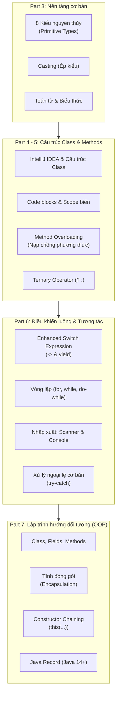

# CẨM NANG ÔN TẬP JAVA CORE (PART 1 - PART 7)
> **Khóa học:** Java Programming Masterclass (JDK 17 + IntelliJ IDEA)  
> **Repository:** `Udemy`  
> **Cập nhật ngày:** 09/10/2026  

---

## MỤC LỤC
1. [Lộ trình & Bản đồ kiến thức](#1-lộ-trình--bản-đồ-kiến-thức)
2. [Phần I: Kiểu dữ liệu, Biểu thức & Ép kiểu (Part 3)](#2-phần-i-kiểu-dữ-liệu-biểu-thức--ép-kiểu-part-3)
3. [Phần II: Phương thức & Nạp chồng (Method Overloading) (Part 4 - 5)](#3-phần-ii-phương-thức--nạp-chồng-method-overloading-part-4---5)
4. [Phần III: Điều khiển luồng, Vòng lặp & Nhập xuất Console (Part 6)](#4-phần-iii-điều-khiển-luồng-vòng-lặp--nhập-xuất-console-part-6)
5. [Phần IV: Lập trình hướng đối tượng - OOP Nền tảng (Part 7)](#5-phần-iv-lập-trình-hướng-đối-tượng---oop-nền-tảng-part-7)
6. [Phần V: Bẫy kinh điển & Best Practices trong Java](#6-phần-v-bẫy-kinh-điển--best-practices-trong-java)
7. [Phần VI: Kiến thức chuẩn bị cho chặng tiếp theo](#7-phần-vi-kiến-thức-chuẩn-bị-cho-chặng-tiếp-theo)

---

## 1. Lộ trình & Bản đồ kiến thức



---

## 2. Phần I: Kiểu dữ liệu, Biểu thức & Ép kiểu (Part 3)

### 2.1. 8 Kiểu dữ liệu nguyên thủy (Primitive Types)
| Kiểu | Kích thước | Khoảng giá trị | Ghi chú / Cú pháp |
| :--- | :--- | :--- | :--- |
| `byte` | 8 bits (1 byte) | -128 đến 127 | Tiết kiệm bộ nhớ cho mảng lớn |
| `short` | 16 bits (2 bytes) | -32,768 đến 32,767 | Ít dùng |
| `int` | 32 bits (4 bytes) | ~ -2.14 tỷ đến 2.14 tỷ | **Kiểu số nguyên mặc định** |
| `long` | 64 bits (8 bytes) | -9x10^18 đến 9x10^18 | Cần hậu tố `L` (ví dụ `100L`) |
| `float` | 32 bits (4 bytes) | Số thực độ chính xác đơn | Cần hậu tố `f` (ví dụ `5.25f`) |
| `double` | 64 bits (8 bytes) | Số thực độ chính xác kép | **Kiểu số thực mặc định** (ví dụ `5.25`) |
| `char` | 16 bits (2 bytes) | Ký tự Unicode đơn | Dùng nháy đơn: `'A'`, `'\u0041'` |
| `boolean`| 1 bit | `true` hoặc `false` | Điều kiện logic |

> **Lưu ý:** `String` không phải primitive type; `String` là đối tượng (Object) đại diện cho chuỗi ký tự bất biến (Immutable).

### 2.2. Ép kiểu (Type Casting)
- **Ép kiểu tự động (Widening / Nâng kiểu):** Từ kiểu kích thước nhỏ sang kiểu lớn hơn, không mất dữ liệu.
  ```java
  int myInt = 9;
  double myDouble = myInt; // Tự động thành 9.0
  ```
- **Ép kiểu tường minh (Narrowing / Hạ kiểu):** Từ kiểu lớn về kiểu nhỏ hơn, có nguy cơ tràn số hoặc mất phần thập phân.
  ```java
  double d = 9.78;
  int i = (int) d; // Kết quả là 9 (phần thập phân bị cắt bỏ)

  short s = 50;
  byte b = (byte) (s / 2); // Cần ép kiểu vì phép tính trả về int
  ```

---

## 3. Phần II: Phương thức & Nạp chồng (Method Overloading) (Part 4 - 5)

### 3.1. Cấu trúc phương thức
```java
public static int calculateScore(boolean gameOver, int score, int levelCompleted, int bonus) {
    if (gameOver) {
        return score + (levelCompleted * bonus);
    }
    return -1;
}
```

### 3.2. Method Overloading (Nạp chồng phương thức)
- **Quy tắc bắt buộc:** Các phương thức phải **cùng tên** nhưng **khác chữ ký tham số (Method Signature)**:
  1. Khác nhau về số lượng tham số.
  2. Hoặc khác nhau về kiểu dữ liệu của tham số.
- **Lưu ý sống còn:** **Chỉ thay đổi kiểu trả về (Return type) thì KHÔNG được tính là overloading** và Java sẽ báo lỗi biên dịch trùng tên.

*Ví dụ thực tế (Từ dự án `OverloadingChanllege`):*
```java
public static double convertToCentimeters(int inches) {
    return inches * 2.54;
}

public static double convertToCentimeters(int feet, int inches) {
    // Tái sử dụng phương thức bên trên:
    return convertToCentimeters((feet * 12) + inches);
}
```

### 3.3. Toán tử ba ngôi (Ternary Operator)
Cú pháp: `condition ? expressionIfTrue : expressionIfFalse;`
Giúp code súc tích thay vì sử dụng khối `if-else` cồng kềnh.
```java
// Thay vì: if (summer) max = 45; else max = 35;
int max = summer ? 45 : 35;
return temperature >= 25 && temperature <= max;
```

---

## 4. Phần III: Điều khiển luồng, Vòng lặp & Nhập xuất Console (Part 6)

### 4.1. Enhanced Switch Expression (Java 14+)
So với switch truyền thống cần `case ...: ... break;`, switch mới dùng mũi tên `->` tự động ngắt:
- Trả về kết quả trực tiếp gán cho biến.
- Nếu case có khối lệnh đa dòng `{ }`, dùng từ khóa `yield` để trả về giá trị.

```java
String dayOfWeek = switch (day) {
    case 0 -> { 
        System.out.println("Processing Sunday");
        yield "Sunday"; 
    }
    case 1 -> "Monday";
    case 2 -> "Tuesday";
    default -> "Invalid day";
};
```

### 4.2. Vòng lặp (Loops)
1. **`for` loop:** Lặp với số bước xác định.
   ```java
   for (int i = 1; i <= 5; i++) { ... }
   ```
2. **`while` loop:** Kiểm tra điều kiện trước khi thực hiện.
3. **`do-while` loop:** Luôn thực hiện thân vòng lặp **ít nhất 1 lần** trước khi kiểm tra điều kiện. Cực kỳ hữu dụng khi yêu cầu người dùng nhập lại dữ liệu cho đến khi hợp lệ.

### 4.3. Kỹ thuật tách chữ số trong số nguyên
Áp dụng cho các bài toán tổng chữ số, số đối xứng (Palindrome), ước số chung:
- Lấy chữ số cuối cùng: `digit = number % 10;`
- Bỏ chữ số cuối cùng: `number = number / 10;`

### 4.4. Nhập dữ liệu và Xử lý ngoại lệ (Exception Handling)
- **`System.console()`**: Trả về `null` khi chạy trong các IDE như IntelliJ IDEA, chỉ hoạt động khi chạy từ Terminal ngoài.
- **`Scanner`**: Đọc từ bàn phím qua `Scanner scanner = new Scanner(System.in);`.
- **Kỹ thuật chống nuốt dòng:** Tránh dùng `scanner.nextInt()` kết hợp với `scanner.nextLine()`. Khuyến nghị dùng `scanner.nextLine()` rồi parse sang số bằng `Integer.parseInt()`.

```java
boolean isValid = false;
int age = 0;
do {
    System.out.print("Enter your year of birth: ");
    try {
        int year = Integer.parseInt(scanner.nextLine());
        if (year >= 1900 && year <= 2026) {
            age = 2026 - year;
            isValid = true;
        } else {
            System.out.println("Year out of range!");
        }
    } catch (NumberFormatException e) {
        System.out.println("Invalid number format! Please enter digits only.");
    }
} while (!isValid);
```

---

## 5. Phần IV: Lập trình hướng đối tượng - OOP Nền tảng (Part 7)

### 5.1. Class & Tính đóng gói (Encapsulation)
- **Class:** Bản thiết kế (Blueprint) định nghĩa trạng thái (Fields/Attributes) và hành vi (Methods).
- **Tính đóng gói:**
  - Thuộc tính luôn đặt `private` để ngăn truy cập trái phép từ bên ngoài.
  - Cung cấp phương thức `public` (Getters / Setters) để đọc và chỉnh sửa có kiểm soát.

### 5.2. Constructor & Constructor Chaining (`this(...)`)
- **Constructor:** Phương thức đặc biệt cùng tên với Class, không có kiểu trả về, chạy ngay khi khởi tạo đối tượng bằng `new`.
- **Constructor Chaining:** Gọi constructor khác trong cùng một class bằng `this(...)` để tập trung logic khởi tạo tại 1 nơi.
- **Quy tắc bắt buộc:** Lệnh `this(...)` **phải luôn nằm ở dòng đầu tiên** của constructor.

*Ví dụ từ class `Account`:*
```java
public class Account {
    private String number;
    private double balance;
    private String customerName;

    // Constructor mặc định gọi Constructor đầy đủ tham số
    public Account() {
        this("56789", 0.0, "Default Customer");
    }

    // Master Constructor chứa toàn bộ logic gán giá trị
    public Account(String number, double balance, String customerName) {
        this.number = number;
        this.balance = balance;
        this.customerName = customerName;
    }
}
```

### 5.3. Java Record (Java 14+)
Record là tính năng hiện đại nhằm thay thế các POJO (Plain Old Java Object) chỉ dùng để chứa dữ liệu không đổi (Data Transfer Object):
```java
public record LPAStudent(String id, String name, String dateOfBirth, String classList) { }
```
**Đặc điểm nổi bật của Record:**
- Mọi trường đều tự động là `private final` (Bất biến - Immutable).
- Tự động sinh sẵn:
  - Canonical Constructor (hàm tạo nhận đủ tham số).
  - Getter có tên trùng với tên trường: `student.name()` (không có tiền tố `get`).
  - Không có Setter (vì dữ liệu là bất biến).
  - Tự động sinh `toString()`, `equals()`, và `hashCode()`.

---

## 6. Phần V: Bẫy kinh điển & Best Practices trong Java

| # | Tình huống | Bẫy thường gặp | Cách xử lý chuẩn |
| :- | :--- | :--- | :--- |
| 1 | **So sánh chuỗi** | Dùng `str1 == str2` (chỉ so sánh địa chỉ ô nhớ). | Luôn dùng `str1.equals(str2)` hoặc `str1.equalsIgnoreCase(str2)`. |
| 2 | **Chia số nguyên** | `5 / 2` cho kết quả `2` thay vì `2.5`. | Ép kiểu 1 số sang số thực: `5.0 / 2` hoặc `(double) a / b`. |
| 3 | **Scanner nuốt dòng** | Gọi `scanner.nextInt()` rồi gọi `scanner.nextLine()` bị bỏ qua bước nhập sau. | Dùng `Integer.parseInt(scanner.nextLine())` cho mọi trường hợp nhập số. |
| 4 | **Constructor chaining** | Viết code log hoặc kiểm tra trước `this(...)` hoặc `super(...)`. | `this(...)` hoặc `super(...)` bắt buộc phải là dòng code đầu tiên trong hàm tạo. |
| 5 | **Fall-through trong Switch** | Quên từ khóa `break;` khiến code nhảy vào case tiếp theo. | Chuyển sang dùng Enhanced Switch với cú pháp mũi tên `->`. |

---

## 7. Phần VI: Kiến thức chuẩn bị cho chặng tiếp theo

Sau khi đã nắm vững Nền tảng OOP (Class, Object, Constructor, Record), chặng tiếp theo của lộ trình Java Masterclass sẽ bao gồm:
1. **Tính kế thừa (Inheritance):**
   - Từ khóa `extends`
   - Gọi hàm tạo lớp cha với `super(...)`
   - Ghi đè phương thức với `@Override`
2. **Lớp Object cha (All classes inherit from `java.lang.Object`):**
   - Cách ghi đè `toString()`, `equals()`, `hashCode()` trong class thông thường.
3. **Tính đa hình (Polymorphism) & Tính trừu tượng (Abstraction):**
   - Abstract Classes & Interfaces.
   - Dynamic Method Dispatch.
4. **Cấu trúc dữ liệu & Thuật toán cơ bản:**
   - Arrays, `ArrayList`, List interface, Autoboxing & Unboxing.
